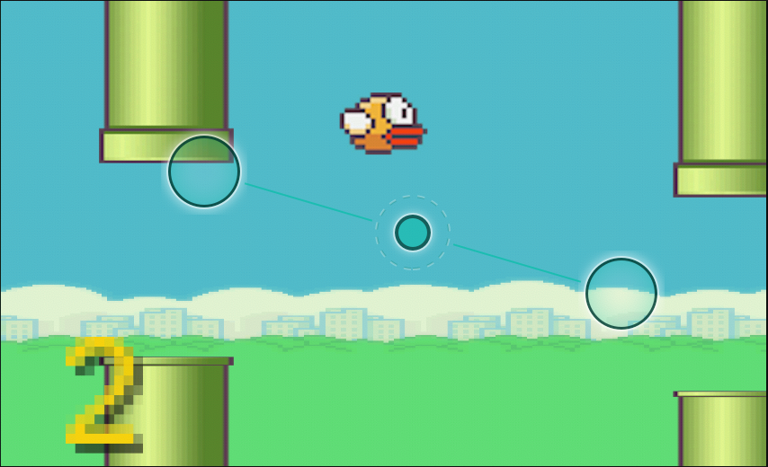
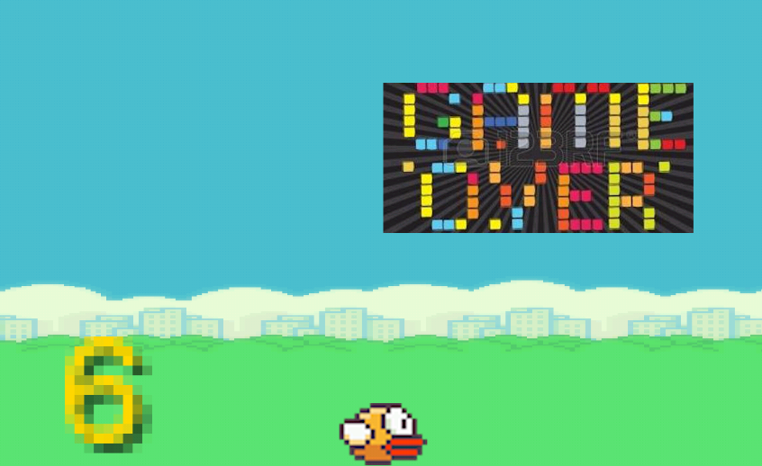

# Flappy Bird Game Recreation for Android

## Introduction
This repo contains a simple implementation of the Flappy Bird game created by Dong Nguyen. The user controls a bird attempting to fly between columns of pipes without colliding into them. For every pipe the bird passes, the user gains a point. The goal of the game is accumulate as many points before colliding into a pipe or touching the ground, as both events lead to a game over. 

## Features
### Keep the bird flying
### Accumulate points by passing a column pipe

### Game over screen

